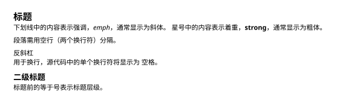
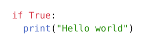

本文将介绍 Typst 的基础用法。

## VS Code 配置

本文仅介绍 VS Code 的配置，但其中用到的 [Tinymist](https://github.com/Myriad-Dreamin/tinymist) 语言服务器也支持其他编辑器，例如 Neovim、Emacs、Sublime 等。
具体方法可参考 Tinymist 的 [文档](https://myriad-dreamin.github.io/tinymist/frontend/main.html)。

笔者推荐使用 [Tinymist](https://marketplace.visualstudio.com/items?itemName=myriad-dreamin.tinymist) 和 [Typst Companion](https://marketplace.visualstudio.com/items?itemName=CalebFiggers.typst-companion) 插件。
前者提供了 Typst 的语法支持和预览功能，后者改善了 Typst 列表的输入体验，例如在列表中换行时自动添加下一项。

## 基础语法

Typst 的基本语法类似 Markdown，更多语法可参考 Typst 的 [文档](https://typst.app/docs/reference/syntax/)。
以下代码中展示了 Typst 的部分语法，读者可以用编辑器新建一个 `basic.typ` 文件并测试语法。

```typst title="basic.typ"
= 标题

下划线中的内容表示强调，_emph_，通常显示为斜体。
星号中的内容表示着重，*strong*，通常显示为粗体。

段落需用空行（两个换行符）分隔。

反斜杠 \ 用于换行，源代码中的单个换行符将显示为
空格。

== 二级标题

标题前的等于号数量表示标题层级。
```



如果字体显示不正常，则需要在文件开头设置字体，例如以下代码会将字体设置为 Noto Sans。

```typst
#set text(font: "Noto Sans")
```

此外，笔者建议为文本设置语言，例如设置为中文。

```typst
#set text(lang: "zh")
```

设置完语言后，Typst 就会自动翻译图片名称和目录标题等，以及自动将双引号 `"` 和单引号 `'` 显示为正确的引号（左右引号或其他引号，取决于语言）。
> [!TIP/合并 set 命令]
> 以上两个 [`set`](https://typst.app/docs/tutorial/advanced-styling/#set-rules) 命令可以也合并成一个：
>
> ```typst
> #set text(font: "Noto Sans", lang: "zh")
> ```

### 代码块

Typst 中代码块语法和 Markdown 一致。
单个反引号 `` `print("Hello world")` `` 表示行内代码。
三个反引号表示代码块，引号后面需要添加语言名称以正确地高亮代码。
示例中展示了一段简单的 “Hello world” 程序。

````typst
```python
if True:
  print("Hello world")
```
````



### 列表

Typst 中列表分为有序列表（[`enum`](https://typst.app/docs/reference/model/enum/)）和无序列表（[`list`](https://typst.app/docs/reference/model/enum/)），前者列表项前面有编号，后者只有统一的标记。
有序列表用加号 `+` 标记，无序列表用减号 `-`。
以下示例中展示了两种不同的列表。

```typst
以下为太阳系中离太阳最近的三颗行星：
+ 水星
+ 金星
+ 地球

地球上存在以下几种常见水果：
- 苹果
- 橘子
- 西瓜
```


### 公式

文章中公式通常分为行内公式和行间公式。
前者用于较短的公式和符号等，后者则用于需要强调或者比较复杂的公式。
Typst 中行内公式和行间公式都使用美元符号 `$` 区分，但行间公式的 `$` 符号和公式之间需要空格或换行符。
例如 `$a^2=b^2+c^2$` 表示行间公式 $a^2=b^2+c^2$，`$ a^2=b^2+c^2 $` 则表示行间公式
$$
a^2=b^2+c^2
$$

笔者推荐使用换行符来更明显地区分行间和行内公式，例如

```typst
$
a^2=b^2+c^2
$
```

Typst 公式中加减乘除的语法类似与计算器中常用的语法，比 $\LaTeX$ 简单而且不需要在函数名前添加反斜杠 `\`。

```typst
(a+b)/c-d e
```


除法只需要用斜杠 `/` 和括号 `()`，而不是像 $\LaTeX$ 一样使用复杂的 `\frac{a}{b}` 语法。
由于 Typst 不用反斜杠区分命令，省略乘法符号时需要用空格区分变量。

此外，Typst 中内置了许多符号和函数，例如常见的 `sum`、`integral`、`lim`、`sin` 等。
以下代码展示了部分符号和函数，`&` 用于对齐各行的等于号、`^` 和 `_`  与 $\LaTeX$ 一样表示上下标。

```typst
$
  sum_(n=1)^10 n&=1+2+ dots.c +10\
  integral_0^pi cos x dif x&=sin pi-sin 0\
  lim_(x->infinity) x^2&=infinity\
  NN&={z in ZZ | z>=0 }
$
```


> [!TIP/拆分公式]
> 默认情况下，Typst 不会将太长的公式拆分到不同页，所以太长的公式可能会被推到下一页并在上一页留下大片空白。
> 在文件开头添加以下代码即可允许 Typst 拆分公式：
>
> ```typst
> #show math.equation: set block(breakable: true)
> ```

Typst 的 [文档](https://typst.app/docs/reference/math/) 中更详细地介绍了公式的语法。
此外，[官网](https://typst.app/docs/reference/symbols/sym/) 上还可以搜索各种符号对应的名称。

## 引用

Typst 也可以像 $\LaTeX$ 一样交叉引用图片、公式、文献等。
本章介绍了 Typst 的引用语法，以及如何调整引用风格。

### 图片和表格

Typst 中图片、表格和代码块等都可以传入 [`figure`](https://typst.app/docs/reference/model/figure/) 函数以添加题注和编号。
具体内容需要使用对应函数、例如用 [`image`](https://typst.app/docs/reference/visualize/image/) 导入本地图片或者用 [`table`](https://typst.app/docs/reference/model/table/) 输出表格。
以下代码展示了一张图片和一个表格。

```typst
@figure_test 中展示了 "TEST"。
@table_f 中列出了函数 $f$ 的值。

#figure(
  image("../img/test.svg", width: 60%),
  caption: [图片展示了 "TEST" 怎么写。],
)<figure_test>

#figure(
  table(
    columns: 2,
    [$x$], [$f(x)$],
    [$1$], [$3$],
    [$2$], [$7$],
  ),
  caption: [函数 $f$ 的值。],
)<table_f>
```


`figure` 的参数 `caption` 的内容将显示为题注。
`figure` 后面用 `<>` 包围的是用于引用的标签（[`label`](https://typst.app/docs/reference/foundations/label/)）。
例如，在 `figure` 后面添加 `<figure_test>` 就可以在文中使用 `@figure_test` 来引用图片。
如果读者需要自定义引用前缀，则可以在引用后面用方括号 `[]` 添加前缀，例如 `@figure_text[图片]` 会显示为 “图片 1”。
同样的语法也可以引用公式和文献。

> [!TIP/图片位置]
> 默认情况下，图片（`figure`）显示位置和 Typst 文件位置中一致，但这样可能会出现大片空白。
> 如果想要让 Typst 自动决定图片显示位置，可以将参数 `placement` 设置为 `auto`，例如 `figure(..., placement: auto)`。
> 读者也可以用 `set` 命令将所有图片位置都设置为 `auto`：
>
> ```typst
> #set figure(placement: auto)
> ```

### 公式

本段将通过示例讲解 Typst 的公式引用。

```typst
#set text(font: "Noto Sans", lang: "zh")

#math.equation(
  $norm((x_1,x_2))=sqrt(x_1^2+x_2^2)$,
  block: true,
  numbering: "(1)",
)<norm>

@norm 定义了二维向量的范数。
注意到
$
  norm((0,0))=0。
$

也可以用 `set` 命令为所有公式添加编号。
@commutativity 定义了交换律。

#set math.equation(numbering: "(1)")
$
  a+b=b+a
$<commutativity>
```


Typst 的公式的 `$$` 语法是 `math.equation(...)` 的 [语法糖](https://zh.wikipedia.org/zh-hans/%E8%AF%AD%E6%B3%95%E7%B3%96)，所以也可以直接调用 [`math.equation`](https://typst.app/docs/reference/math/equation/) 以显示公式。
这种方式可以往函数里传入额外参数，例如示例中传入的 `block: true` 代表行间公式，`numbering: "(1)"` 代表公式编号格式为 “(1)”、“(2)” 等。
编号规则的细节可以参考 Typst 的 [文档](https://typst.app/docs/reference/model/numbering/)。

默认情况下，Typst 的公式没有编号，所以可以用 `set` 命令为所有（之后的）公式添加编号。
但是这样不方便添加无编号的公式，所以笔者推荐单独为有编号的公式定义一个函数。

```typst
#let numbered_equation(content) = math.equation(
  block: true,
  numbering: "(1)",
  content,
)

// 用法
#numbered_equation($a+b=b+a$)<commutativity>
```

> [!TIP/提示]
> 除了函数以外，[`let`](https://typst.app/docs/reference/scripting/#bindings) 语法也可以定义变量。

如果读者想在引用公式时在编号前后添加括号，例如 “式 (1)”，可以在文件开头添加以下代码：

```typst
#show ref: x => {
  let element = x.element

  if element != none and element.func() == math.equation {
    link(element.location())[#element.supplement~#numbering(
        element.numbering,
        ..counter(math.equation).at(element.location()),
      )]
  } else {
    x
  }
}
```

代码修改自官网上的示例，但其除了在编号前后添加括号外，还额外保留了公式引用的前缀，例如 “式”。
[`show`](https://typst.app/docs/tutorial/advanced-styling/) 语法类似于 `set` 语法，但不同之处在于其可以用函数修改选中的元素。
这段代码中修改了 [`ref`](https://typst.app/docs/reference/model/ref/)，即 `@` 语法实际调用的函数。

### 文献

Typst 的文献引用和图片一样使用 `@` 语法。
以下示例展示了文献引用的用法。

```typst wrap
#set text(font: "Noto Sans", lang: "zh")

Typst 的其中一位创始人 #cite(<madje_typst>, form: "author") 于 #cite(<madje_typst>, form: "year") 年在其硕士论文中介绍了 Typst 的语法 @madje_typst。
另一位创始人 #cite(<haug_fast_typesetting>, form: "author") 则在其硕士论文中介绍了 Typst 增量式编译的原理 @haug_fast_typesetting。

#bibliography("bibliography.bib", style: "ieee")
```


示例中的 [`bibliography`](https://typst.app/docs/reference/model/bibliography/) 函数可以导入 [BibTeX](https://www.bibtex.org/) 或 [Hayagriva](https://github.com/typst/hayagriva/blob/main/docs/file-format.md) 格式的文件并生成参考文献列表。
以下是示例中用到的 BibTeX 文件。

```bibtex title="bibliography.bib"
@phdthesis{haug_fast_typesetting,
    author = {Martin E. Haug},
    doi    = {10.13140/RG.2.2.15606.88642},
    school = {Technical University of Berlin},
    title  = {Fast Typesetting with Incremental Compilation},
    year   = {2022}
}

@phdthesis{madje_typst,
    author = {Laurenz Mädje},
    school = {Technical University of Berlin},
    title  = {Typst -- A Programmable Markup Language for Typesetting},
    year   = {2022}
}
```

文献引用的 `@` 语法实际调用的 [`cite`](https://typst.app/docs/reference/model/cite/) 函数也可以像 $\LaTeX$ 的 `\citeauthor` 和 `\citeyear` 一样输出文献作者和年份。
`form` 参数决定了 `cite` 的输出，`"author"` 对应作者、`"year"` 对应年份，默认情况下输出和直接用 `@` 语法一致。
引用风格则可以通过 `bibliography` 的 `style` 参数调整，例如 `"ieee"`、`"apa"` 等，其他常用格式可以参考 Typst 的 [文档](https://typst.app/docs/reference/model/bibliography/#parameters-style)。

## 导入文件和包

由于文档太长时修改会变得非常困难，笔者认为排版软件应该提供导入文件的功能。
例如 $\LaTeX$ 中可以用 `\input` 或 `\include` 导入文件内容，而 Typst 中则可以用 [`include`](https://typst.app/docs/reference/scripting/#modules) 语法导入其他文件中的内容。
以下代码中展示了 Typst 的文件导入语法。

```typst
= Typst 的用法
== 引言
...

#include "路径/方法.typ"
#include "路径/总结.typ"

其他内容
```

`include` 的内容会按导入顺序出现在结果里，例如示例中导入的 `方法.typ` 中的内容会出现在 “引言” 和 “其他内容” 之间。

Typst 的导入与 $\LaTeX$ 最大的不同在于 `\input` 或 `\include` 中定义的宏都是全局的，而 Typst 的导入文件时不会导入其中定义的函数和变量。
但 Typst 并非不能导入函数和变量，Typst 导入这些需要用 `import` 语法。
例如以下代码在 `main.typ` 文件中导入并使用了 `utils.typ` 文件中定义的 `numbered_equation` 函数。

```typst title="utils.typ"
#let numbered_equation(content) = math.equation(
  block: true,
  numbering: "(1)",
  content,
)
```

```typst title="main.typ"
#import "./utils.typ": numbered_equation

#numbered_equation($1+1=2$)<sum_of_ones>
```

为了避免重新造轮子，Typst 有大量的 [第三方包](https://typst.app/universe) 可导入。
例如以下几个常用的 $\LaTeX$ 包都有对应的 Typst 包：

- [cetz](https://typst.app/universe/package/cetz/)：类似 TikZ，可用于画图、制作图表等
- [unify](https://typst.app/universe/package/unify/)：类似 siunitx 包，用于为数值添加 SI 单位
- [touying](https://typst.app/universe/package/touying/)：类似 Beamer，用于制作幻灯片

导入第三方包的语法和导入文件类似。
以 cetz 为例，以下代码导入了 cetz 0.4.0 版本中的 `canvas` 函数。

```typst
#import "@preview/cetz:0.4.0": canvas
```

> [!NOTE/备注]
> 由于 Typst 的包管理系统还不成熟，导入时需要添加 `@preview` 前缀 [^typst_preview_prefix]。
> 以后可能会改变。

## 模板

## 编程

## 细节

a

[^typst_preview_prefix]: Typst Packages, https://github.com/typst/packages/?tab=readme-ov-file#published-packages
