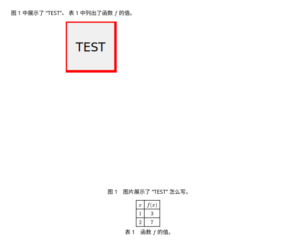

本文将介绍 Typst 的基础用法。

## VS Code 配置

本文仅介绍 VS Code 的配置，但其中用到的 [Tinymist](https://github.com/Myriad-Dreamin/tinymist) 语言服务器也支持其他编辑器，例如 Neovim、Emacs、Sublime 等。
具体方法可参考 Tinymist 的 [文档](https://myriad-dreamin.github.io/tinymist/frontend/main.html)。

笔者推荐使用 [Tinymist](https://marketplace.visualstudio.com/items?itemName=myriad-dreamin.tinymist) 和 [Typst Companion](https://marketplace.visualstudio.com/items?itemName=CalebFiggers.typst-companion) 插件。
前者提供了 Typst 的语法支持和预览功能，后者改善了 Typst 列表的输入体验，例如在列表中换行时自动添加下一项。

## 基本语法

Typst 的基本语法类似 Markdown，更多语法可参考 Typst 的 [文档](https://typst.app/docs/reference/syntax/)。
以下代码中展示了 Typst 的部分语法，读者可以用编辑器新建一个 `basic.typ` 文件并测试语法。

```typst title="basic.typ"
= 标题

下划线中的内容表示强调，_emph_，通常显示为斜体。
星号中的内容表示着重，*strong*，通常显示为粗体。

段落需用空行（两个换行符）分隔。

反斜杠 \ 用于换行，源代码中的单个换行符将显示为
空格。

== 二级标题

标题前的等于号数量表示标题层级。
```


如果字体显示不正常，则需要在文件开头设置字体，例如以下代码会将字体设置为 Noto Sans。

```typst
#set text(font: "Noto Sans")
```

此外，笔者建议为文本设置语言，例如设置为中文。

```typst
#set text(lang: "zh")
```

设置完语言后，Typst 就会自动翻译图片名称和目录标题等，以及自动将双引号 `"` 和单引号 `'` 显示为正确的引号（左右引号或其他引号，取决于语言）。
此外，以上几个 [`set`](https://typst.app/docs/tutorial/advanced-styling/#set-rules) 命令可以也合并成一个

```typst
#set text(font: "Noto Sans", lang: "zh")
```

## 代码块

Typst 中代码块语法和 Markdown 一致。
单个反引号 `` `print("Hello world")` `` 表示行内代码。
三个反引号表示代码块，引号后面需要添加语言名称以正确地高亮代码。

````typst
```python
print("Hello world")
```
````

## 公式

文章中公式通常分为行内公式和行间公式。
前者用于较短的公式和符号等，后者则用于需要强调或者比较复杂的公式。
Typst 中行内公式和行间公式都使用美元符号 `$` 区分，但行间公式的 `$` 符号和公式之间需要空格或换行符。
例如 `$a^2=b^2+c^2$` 表示行间公式 $a^2=b^2+c^2$，`$ a^2=b^2+c^2 $` 则表示行间公式
$$
a^2=b^2+c^2
$$

笔者推荐使用换行符来更明显地区分行间和行内公式，例如

```typst
$
a^2=b^2+c^2
$
```

Typst 公式中加减乘除的语法类似与计算器中常用的语法，比 $\LaTeX$ 简单而且不需要在函数名前添加反斜杠 `\`。

```typst
(a+b)/c-d e
```


除法只需要用斜杠 `/` 和括号 `()`，而不是像 $\LaTeX$ 一样使用复杂的 `\frac{a}{b}` 语法。
由于 Typst 不用反斜杠区分命令，省略乘法符号时需要用空格区分变量。

此外，Typst 中内置了许多符号和函数，例如常见的 `sum`、`integral`、`lim`、`sin` 等。
以下代码展示了部分符号和函数，`&` 用于对齐各行的等于号、`^` 和 `_`  与 $\LaTeX$ 一样表示上下标。

```typst
$
  sum_(n=1)^10 n&=1+2+ dots.c +10\
  integral_0^pi cos x dif x&=sin pi-sin 0\
  lim_(x->infinity) x^2&=infinity\
  NN&={z in ZZ | z>=0 }
$
```


Typst 的 [文档](https://typst.app/docs/reference/math/) 中更详细地介绍了公式的语法。
此外，[官网](https://typst.app/docs/reference/symbols/sym/) 上还可以搜索各种符号对应的名称。

## 引用

### 图片和表格

Typst 中图片、表格和代码块等都可以传入 [`figure`](https://typst.app/docs/reference/model/figure/) 函数以添加题注和编号。
具体内容需要使用对应函数、例如用 [`image`](https://typst.app/docs/reference/visualize/image/) 导入本地图片或者用 [`table`](https://typst.app/docs/reference/model/table/) 输出表格。
以下代码展示了一张图片和一个表格。

```typst
@figure_test 中展示了 "TEST"。
@table_f 中列出了函数 $f$ 的值。

#figure(
  image("../img/test.svg", width: 60%),
  caption: [图片展示了 "TEST" 怎么写。],
)<figure_test>

#figure(
  table(
    columns: 2,
    [$x$], [$f(x)$],
    [$1$], [$3$],
    [$2$], [$7$],
  ),
  caption: [函数 $f$ 的值。],
)<table_f>
```



`figure` 的参数 `caption` 的内容将显示为题注。
`figure` 后面用 `<>` 包围的是用于引用的标签。
例如，在 `figure` 后面添加 `<figure_test>` 就可以在文中使用 `@figure_test` 来引用图片。
如果读者需要自定义引用前缀，则可以在引用后面用方括号 `[]` 添加前缀，例如 `@figure_text[图片]` 会显示为 “图片 1”。
同样的语法也可以引用公式和文献。

### 公式

本段将通过实例讲解 Typst 的公式引用。

```typst
#set text(font: "Noto Sans", lang: "zh")

#math.equation(
  $norm((x_1,x_2))=sqrt(x_1^2+x_2^2)$,
  block: true,
  numbering: "(1)",
)<norm>

@norm 定义了二维向量的范数。
注意到
$
  norm((0,0))=0。
$

也可以用 `set` 命令为所有公式添加编号。
@commutativity 定义了交换律。

#set math.equation(numbering: "(1)")
$
  a+b=b+a
$<commutativity>
```


Typst 的公式的 `$$` 语法是 `math.equation(...)` 的 [语法糖](https://zh.wikipedia.org/zh-hans/%E8%AF%AD%E6%B3%95%E7%B3%96)，所以也可以直接调用 [`math.equation`](https://typst.app/docs/reference/math/equation/) 以显示公式。
这种方式可以往函数里传入额外参数，例如示例中传入的 `block: true` 代表行间公式，`numbering: "(1)"` 代表公式编号格式为 “(1)”、“(2)” 等。
编号规则的细节可以参考 Typst 的 [文档](https://typst.app/docs/reference/model/numbering/)。

默认情况下，Typst 的公式没有编号，所以可以用 `set` 命令为所有（之后的）公式添加编号。
笔者推荐单独为有编号的公式定义一个函数。
变量和函数可以用 [`let`](https://typst.app/docs/reference/scripting/#bindings) 语法定义。

```typst
#let numbered_equation(content) = math.equation(
  block: true,
  numbering: "(1)",
  content,
)

// 用法
#numbered_equation($a+b=b+a$)<commutativity>
```

如果读者想在引用公式时在编号前后添加括号，例如 “式 (1)”，可以在文件开头添加以下代码：

```typst
#show ref: x => {
  let element = x.element

  if element != none and element.func() == math.equation {
    link(element.location())[#element.supplement~#numbering(
        element.numbering,
        ..counter(math.equation).at(element.location()),
      )]
  } else {
    x
  }
}
```

这段代码中会保留公式引用的前缀和链接并在编号前后添加括号。
[`show`](https://typst.app/docs/tutorial/advanced-styling/) 语法类似于 `set` 语法，但不同之处在于其可以用函数修改选中的元素，这段代码中修改了 [`ref`](https://typst.app/docs/reference/model/ref/)，即 `@` 引用实际调用的函数。

### 文献

```typst
#set text(font: "Noto Sans", lang: "zh")

硕德在 @norm_zero 证明了
$
  norm((0,0))=0。
$

#bibliography("bibliography.bib")
```

前面示例中的 [`bibliography`](https://typst.app/docs/reference/model/bibliography/) 可以导入 [BibTeX](https://www.bibtex.org/) 或 [Hayagriva](https://github.com/typst/hayagriva/blob/main/docs/file-format.md) 格式的文献并生成参考文献列表。
引用格式可以通过 `style` 参数调整，Typst 的文档中列出了许多常用的格式。
以下是示例中用到的 BibTeX 文件。

```bibtex title="bibliography.bib"
@article{norm_zero,
  author  = {沃兹基, 硕德},
  journal = {志杂学数},
  title   = {证明零向量的范数为零},
  year    = {5202}
}
```

## 将文档拆分为多个文件

## 导入第三方包

## 编程

## 细节
