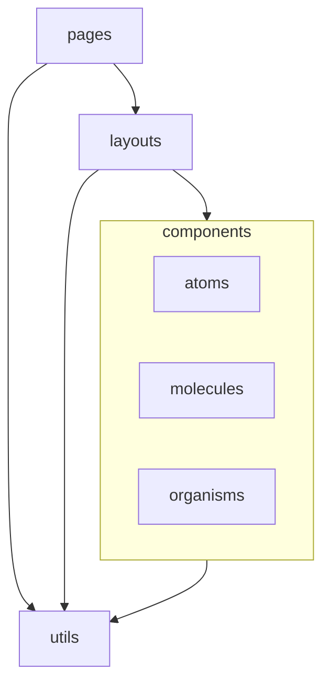
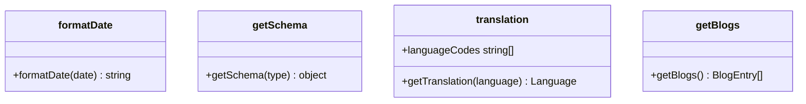

# Architecture

The architecture follows [atomic design](https://bradfrost.com/blog/post/atomic-web-design/).

```mermaid
graph TB
pages --> layouts
pages --> utils

layouts --> components
layouts --> utils

subgraph components
    atoms
    molecules
    organisms
end

components --> utils
```

## Utils

```mermaid
classDiagram

class formatDate {
    +formatDate(date) string
}
class getSchema {
    +getSchema(type) object
}
class translation {
    +languageCodes string[]
    +getTranslation(language) Language
}
class getBlogs {
    +getBlogs() BlogEntry[]
}
```
