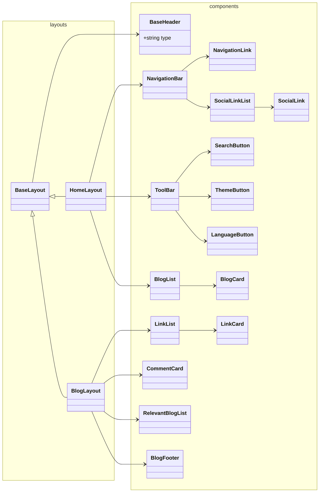
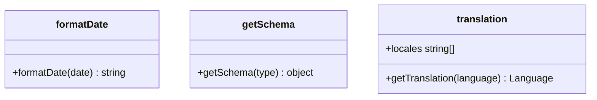

# Architecture

## UI

```mermaid
classDiagram
direction LR
BaseLayout --> BaseHeader
BaseLayout <|-- HomeLayout
BaseLayout <|-- BlogLayout

HomeLayout --> NavigationBar
HomeLayout --> ToolBar
HomeLayout --> BlogList

BlogLayout --> LinkList
BlogLayout --> CommentCard
BlogLayout --> RelevantBlogList
BlogLayout --> BlogFooter

LinkList --> LinkCard

BlogList --> BlogCard

NavigationBar --> NavigationLink
NavigationBar --> SocialLinkList
SocialLinkList --> SocialLink

ToolBar --> SearchButton
ToolBar --> ThemeButton
ToolBar --> LanguageButton

namespace layouts {
    class HomeLayout
    class BlogLayout
    class BaseLayout
}

namespace components {
    class ToolBar
    class NavigationBar
    class NavigationLink
    class SocialLink
    class SocialLinkList
    class BlogCard
    class BlogList
    class LinkCard
    class LinkList
    class CommentCard
    class RelevantBlogList
    class SearchButton
    class ThemeButton
    class LanguageButton
    class BaseHeader {
        +string type
    }
    class BlogFooter
}
```

## Utils

```mermaid
classDiagram

class formatDate {
    +formatDate(date) string
}
class getSchema {
    +getSchema(type) object
}
class translation {
    +locales string[]
    +getTranslation(language) Language
}
```