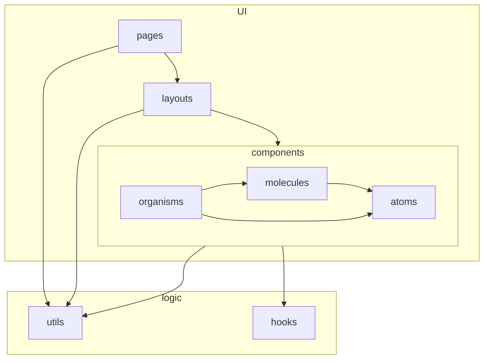
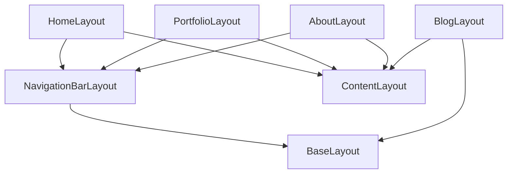

# Architecture

The UI architecture mostly follows [atomic design](https://bradfrost.com/blog/post/atomic-web-design/):

- atoms: Non-divisible component
- molecules: Combination of atoms
- organisms: Self-contained, functional part
- layouts: Template for a page or larger part of a page
- pages: Invidual page or non-HTML file, passes data/content to layouts

Logic is divided to:

- utils: Stateless, mostly server-side
- hooks: Stateful, client-side, for React components

## Layouts

