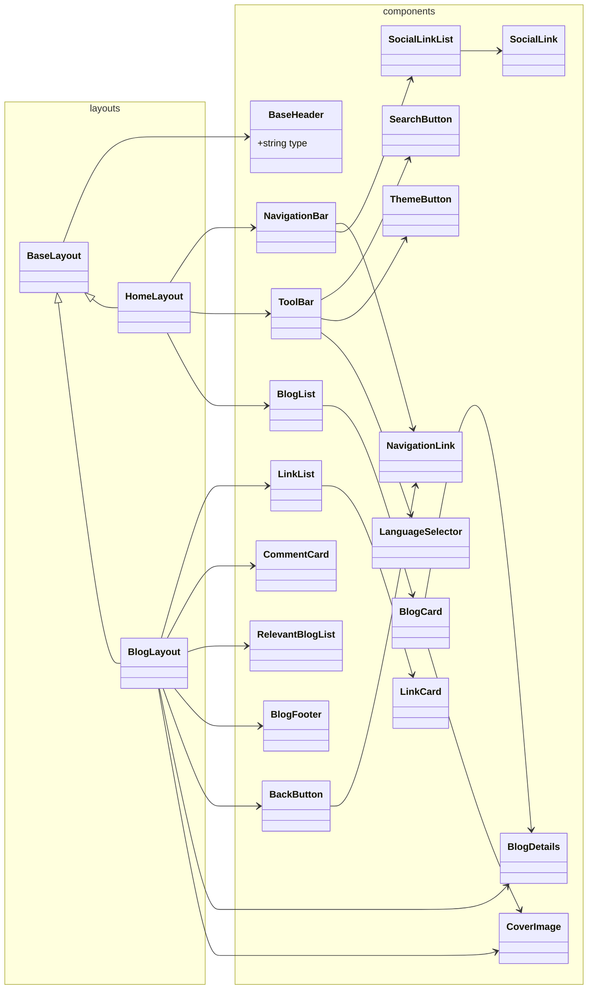
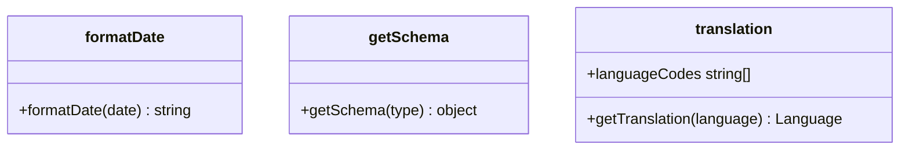

# Architecture

## UI

```mermaid
classDiagram
direction LR
BaseLayout --> BaseHeader
BaseLayout <|-- HomeLayout
BaseLayout <|-- BlogLayout

HomeLayout --> NavigationBar
HomeLayout --> ToolBar
HomeLayout --> BlogList

BlogLayout --> LinkList
BlogLayout --> CommentCard
BlogLayout --> RelevantBlogList
BlogLayout --> BlogFooter
BlogLayout --> BackButton
BlogLayout --> BlogDetails
BlogLayout --> CoverImage

LinkList --> LinkCard
BlogList --> BlogCard
SocialLinkList --> SocialLink

NavigationBar --> NavigationLink
NavigationBar --> SocialLinkList

ToolBar --> SearchButton
ToolBar --> ThemeButton
ToolBar --> LanguageSelector

BackButton --> NavigationLink

BlogCard --> BlogDetails
BlogCard --> CoverImage

namespace layouts {
    class HomeLayout
    class BlogLayout
    class BaseLayout
}

namespace components {
    class ToolBar
    class NavigationBar
    class NavigationLink
    class SocialLink
    class SocialLinkList
    class BlogCard
    class BlogList
    class LinkCard
    class LinkList
    class CommentCard
    class RelevantBlogList
    class SearchButton
    class ThemeButton
    class LanguageSelector
    class BaseHeader {
        +string type
    }
    class BlogFooter
    class BlogDetails
    class CoverImage
    class BackButton
}
```

## Utils

```mermaid
classDiagram

class formatDate {
    +formatDate(date) string
}
class getSchema {
    +getSchema(type) object
}
class translation {
    +languageCodes string[]
    +getTranslation(language) Language
}
```
