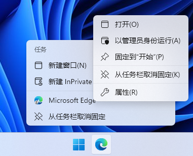

Visual Studio Code 内置的 JavaScript Debugger 调试用的 Edge 配置文件和 Edge 默认的配置文件冲突导致任务栏新建的 Edge 窗口使用的是调试用配置文件。
本文为此提供了一种解决方式。

<!--more-->

## 问题

从任务栏新建的 Edge 窗口使用的是其他配置文件。

## 原因

任务栏上的 Edge 启动参数 `--profile-directory=Default` 中的配置文件和 VSCode JavaScript Debugger 调试用的 Edge 配置文件 `%APPDATA%\Code\User\workspaceStorage\...\ms-vscode.js-debug\.profile\Default` 重名。

## 解决方式

1. 将 `%LOCALAPPDATA%\Microsoft\Edge\User Data\Default` 中的 Default 配置文件改名，例如 `Profile 1`
2. 将任务栏中快捷方式的启动参数改为新配置文件的名称，例如 `--profile-directory="Profile 1"`

    

    
